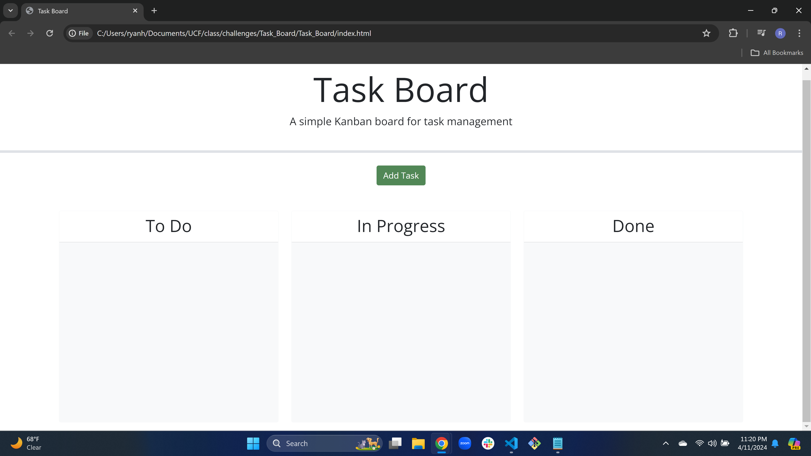
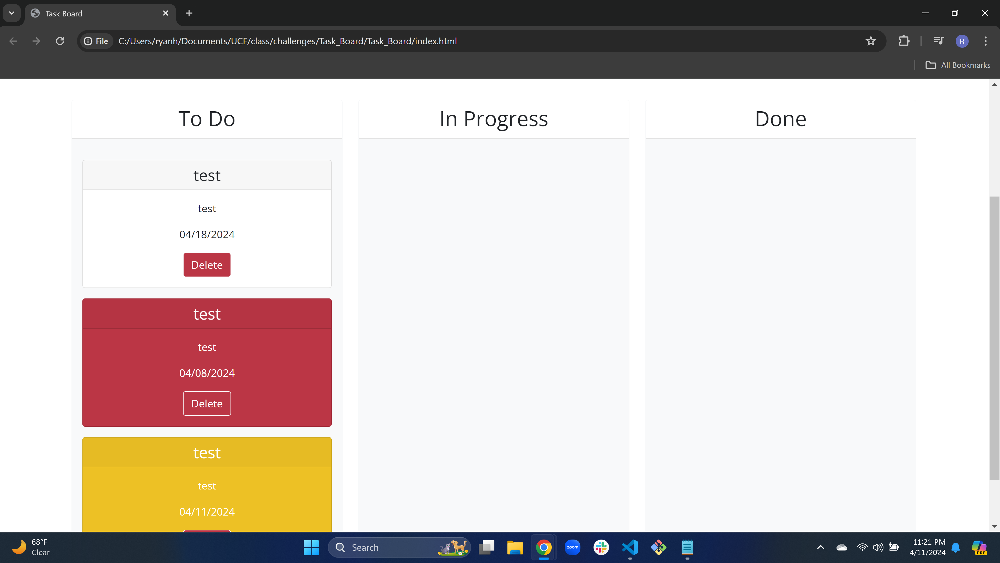
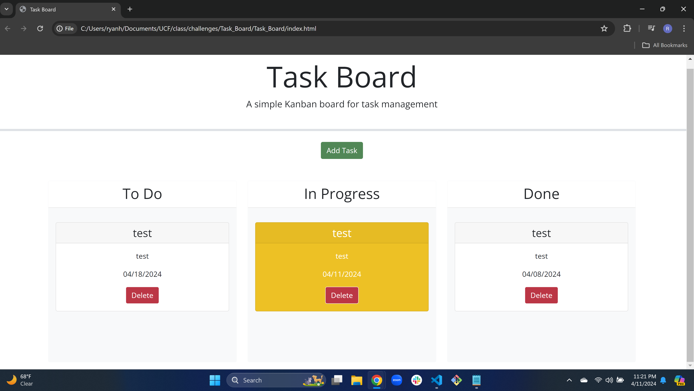
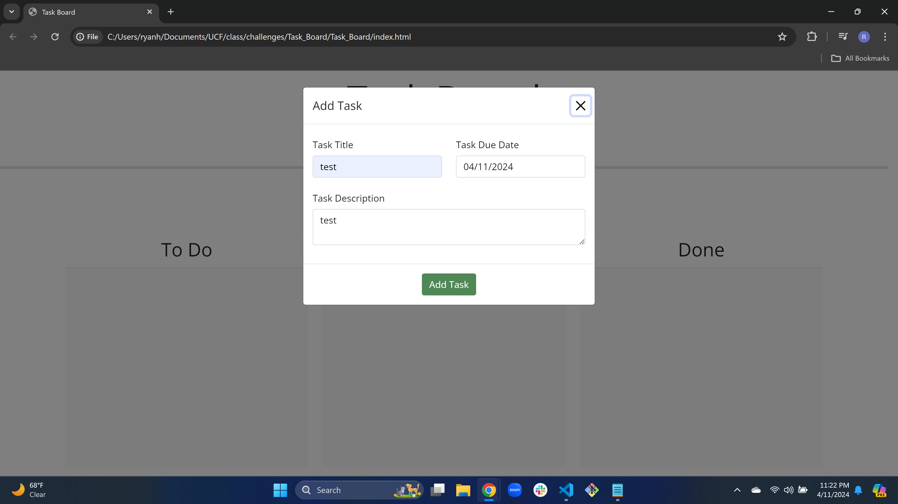

# Task_Board

## Description

I was motivated in this challenge to make a task board with some starter code that I was given. I got to try out some new third-party apis like jquery and bootstrap. The goal that I wanted to acomplish was to have a modal pop up with a form where I would fill it out and then a card will spawn in the todo column. Then I would be able to move the card or cards into a different column where the card status would update when in a new column. I also wanted a color changer depending on if the task was past due (red) or on the day of due date (yellow). I learned how helpful and a little stressful third-party apis can be in coding. I got an even better learning of arrays and how complex they can get to be and I also learned how to delete one string of an array with a unique id.

## Website Link

https://ryanh118.github.io/Task_Board/

## Usage

